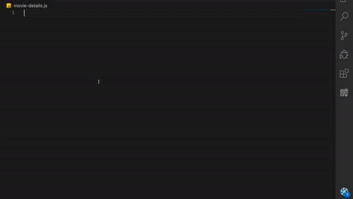

# Lit and Webcomponents Snippets for VS Code

This extension for Visual Studio Code adds snippets of HTML and Javascript for [LitElement](https://lit-element.polymer-project.org), [lit-html](https://lit-html.polymer-project.org), and [Web components](https://www.webcomponents.org/introduction).

Have a look at [CHANGELOG](CHANGELOG.md) for the latest changes

## Installation

1.  Install Visual Studio Code 1.10.0 or higher
1.  Launch VS Code
1.  Hit `Cmd`-`Shift`-`P` (macOS) or `Ctrl`-`Shift`-`P` (Windows, Linux)
1.  Select `Install Extension`
1.  Choose the extension `Lit and Webcomponents snippets`
1.  Reload Visual Studio Code

## Usage

Start typing `lit-*` and hit `enter`, the snippet spreads out.

### LitElement and lit-html Snippets

| Snippet                    | Purpose                                     |
| -------------------------- | ------------------------------------------- |
| `lit-component`            | Basic Lit component                         |
| `lit-component-decorator`  | Basic Lit component using decorator         |
| `lit-render`               | `render()`                                  |
| `lit-props`                | `properties()`                              |
| `lit-props-decorator`      | `@property` decorator                       |
| `lit-styles`               | `styles()`                                  |
| `lit-ctor`                 | Add `constructor()`                         |
| `lit-cb`                   | `connectedCallback()` life cycle method     |
| `lit-dcb`                  | `disconnectedCallback()`life cycle method   |
| `lit-first-updated`        | `firstUpdated()`life cycle method           |
| `lit-updated`              | `updated()`life cycle method                |
| `lit-ce`                   | Create the custom event using `CustomEvent` |
| `lit-conditional-template` | Create conditional template expression      |
| `lit-tmpl-loop`            | Iterate templates through `map()`           |
| `lit-style`                | Add `styleMap()` to the element             |
| `lit-class`                | Add `classMap()` to the element             |

### Web Components Snippets

| Snippet                   | Purpose                           |
| ------------------------- | --------------------------------- |
| `wc`                      | Basic Web Component               |
| `wc-observed-attrs`       | Define `observedAttributes`       |
| `wc-adopted-cb`           | Define `adoptedCallback`          |
| `wc-attribute-changed-cb` | Define `attributeChangedCallback` |

### Using NgRx or Angualr material

- Check out [NgRx Snippets](https://bit.ly/ngrx-vscode)
- Check out [Angular Material Snippets](https://bit.ly/ng-material-vscode)
